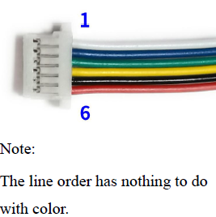

# esphome-gm861
ESPHome component to read barcodes via UART or USB with the GM861 Bar Code Reader Module by Hangzhou Grow Technology Co., Ltd.

Additional information about the GM861 can be found on the manufacturer's website:
- [Product Info](http://www.growscanner.com/productinfo/888747.html)
- [User Guide](http://www.growbarcode.com/filedownload/126719)

## Component Features
- Logs barcode / QR code data received from the device.
- Sends heartbeat packets to ensure the device is working properly, logging errors and disabling the device if the heartbeat fails 3 consecutive times.

## Formats supported by the GM861 Module
**1D Formats:** EAN-8, UPC-A, UPC-E, ISSN, ISBN, CodaBar, Code 128, Code93, ITF-14, ITF-6, Interleaved 2 of 5, Industrial 2 of 5, Matrix 2 of 5, Code 39, Code 11, MSI-Plessey, GS1 Composite, GS1-Databar (RSS)

**2D Formats:** QR Code, Data Matrix, PDF417

## GM861 Pinout
<table><tr><td>
         
| Pin | Def | Description      |
| --- | --- | ---------------  |
| 1   | D+  | USB data output  |
| 2   | D-  | USB data input   |
| 3   | GND | Signal Ground    |
| 4   | RXD | Serial port receiver signal (TTL Level) |
| 5   | TXD | Serial port send signal (TTL Level) |
| 6   | VCC | Power input 3.3V |

</td><td>
   


</td></tr></table>


## YAML
Add this repository to your ESPHome configuration:
   ```yaml
   external_components:
     - source:
         type: git
         url: https://github.com/mudpoet/esphome-gm861.git
       components: [gm861_uart]
   ```
